# latent-flow-model
conditional latent flow matching from scratch
simple, minimal, classifier free, PyTorch

Continuous Normalizing Flows (CNFs)
Flow Matching (FM)
[Flow Matching for Generative Modeling (feb 2023)](https://arxiv.org/pdf/2210.02747.pdf)

[High-Resolution Image Synthesis with Latent Diffusion Models (apr 2022)](https://arxiv.org/pdf/2112.10752)
Stable Diffusion; Latent Diffusion Models(LDM)

[Photorealistic Text-to-Image Diffusion Models with Deep Language Understanding (may 2022)](https://arxiv.org/pdf/2205.11487)
Imagen

## An exploration into timestep stepsize during sampling
---
After having trained a Flow matching model, the image generation is performed through a non-trivial sampling step. This sampling step is essentially a reversal of the ODE that the flow model represents and there are many ODE solvers to accomplish this. While adaptive solvers are able to produce high quality generations with little hyperparameter tuning, it is at the expense of speed and simplicity.
Here, we explore various timestep schedules for image generation with euler's method, to enable efficient yet simple generation of images from flow matching models.
  
We explore the four following classes of (bounded monotonic increasing) curves:
#### 1) Linear
#### 2) S-shaped
#### 3) Invere Exponential
#### 4) Inverted S shape

horizontal axis: time step 
vertical axis: t value for sampling

### 1) Linear

  
&nbsp;

  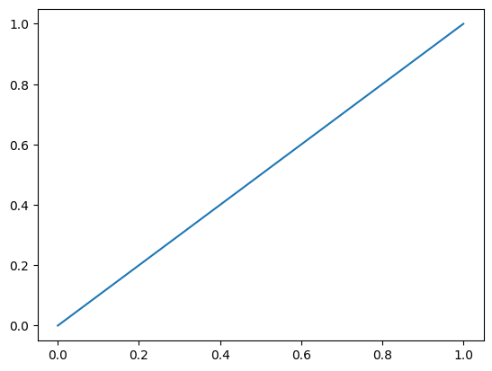
  
Linear

constant stepsize of 1/num_steps
  

### 2) S-shaped

  
&nbsp;

  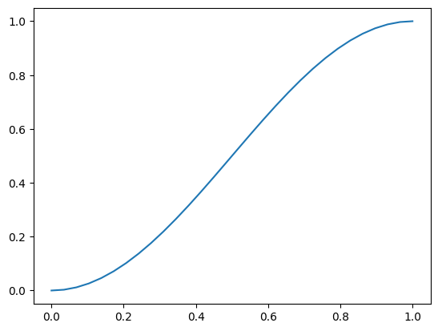
  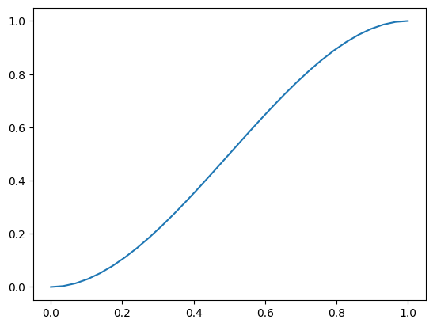
  
Cosine | Polynomial

small steps at the start and end and larger steps in the middle

### 3) Inverse Exponential

  
&nbsp;

  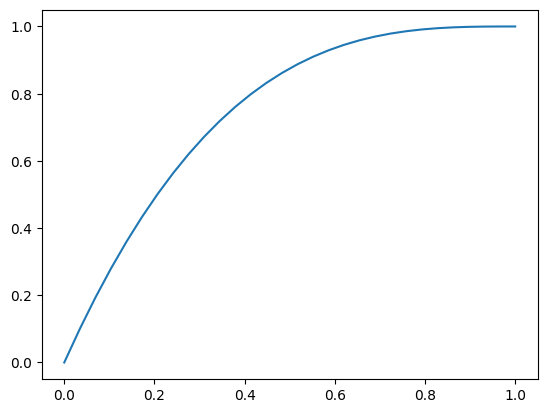
  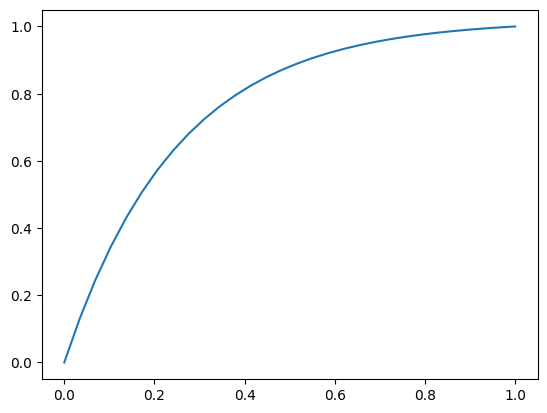
  
Inverted Cubic | Invert Exponential

start with large stepsizes and quickly slow down when converging to the final limage
  

### 4) Inverted S-shape

  
&nbsp;

  
<!--   
Logit-Normal CDF with mu=0, std=3
 -->

large steps at the start and end and smaller steps in the middle
[Logit-Normal](https://en.wikipedia.org/wiki/Logit-normal_distribution) CDF inspired by the Logit-Normal distribution used during training, method introduced by the paper
[Scaling Rectified Flow Transformers for High-Resolution Image Synthesis mar 2024](https://arxiv.org/pdf/2403.03206)
refered in the paper as rf/lognorm(0.00, 1.00)
we take the CDF of this distribution.

  

## Results
---
### 1) Linear

  
&nbsp;

  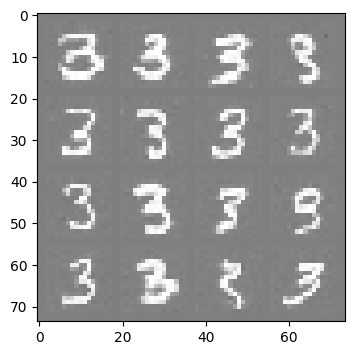
<!--   
JEPA architecture | Hierarchial JEPA 
 -->

good baseline results
  

### 2) S-shaped

  
&nbsp;

  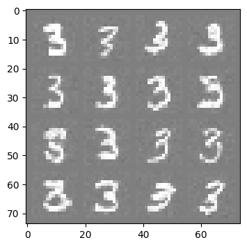
  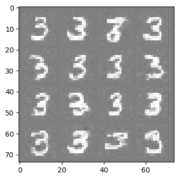
<!--   
JEPA architecture | Hierarchial JEPA 
 -->

quality is worse than linear
  

### 3) Invere Exponential

  
&nbsp;

  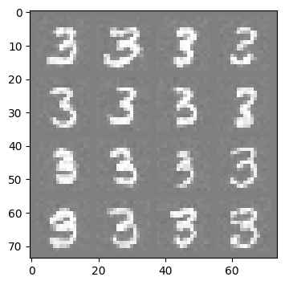
  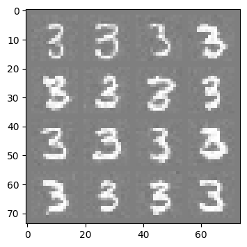
<!--   
JEPA architecture | Hierarchial JEPA 
 -->

quality also worse than linear
  

### 4) Inverted S-shape

  
&nbsp;

  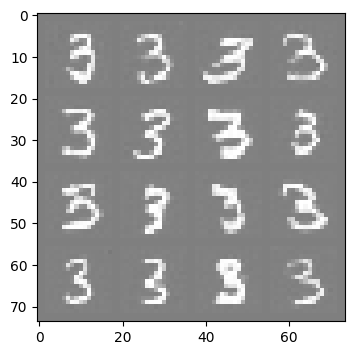
  
Logit-Normal CDF with mu=0, std=3

gives the best results
  

## Position of slowdown
---
Next, we explore how the position of the slowed position influences generation quality
the Logit-Normal CDF has two parameters, the 'std' affecting the "curviness" of the S shape and 'mu' (which we are using in this case) biasing the "slowed" portion of the curve towards the start or end.

  
&nbsp;

  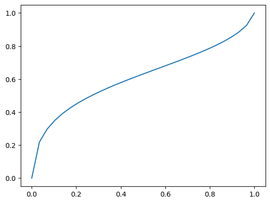
  
  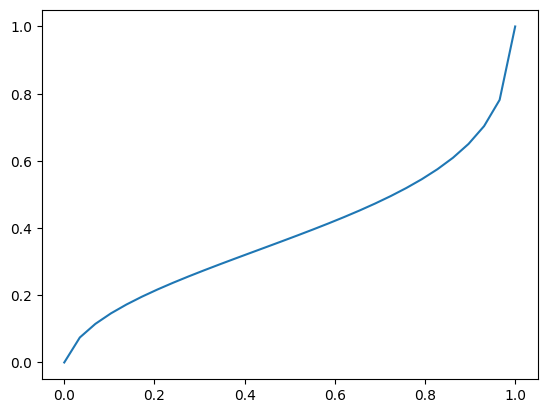
  
Logit-Normal CDF with std=3 and mu=-1(left), mu=0(mid), mu=1(right)

  
&nbsp;

  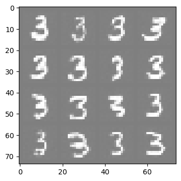
  
  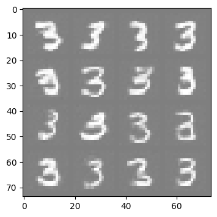
<!--   
JEPA architecture | Hierarchial JEPA 
 -->

We seem to get better results when position of slowdown is towards the end.

